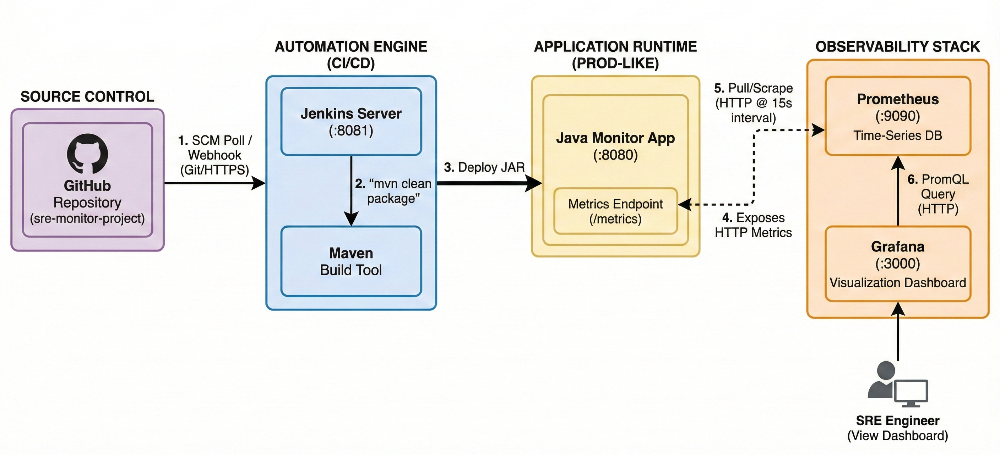

# sre-monitor-project

SRE Observability & Automation Pipeline
=======================================

### **Objective**

To engineer a professional-grade monitoring ecosystem that automates the software development lifecycle (SDLC). The project demonstrates how a Java application can be built, deployed, and monitored automatically, providing real-time visibility into system health and performance metrics.

### **Technology Stack**

*   **Language:** Java (Enterprise-ready JAR packaging)
    
*   **Build Tool:** Maven (Project lifecycle management)
    
*   **CI/CD:** Jenkins (Pipeline-as-Code with Jenkinsfile)
    
*   **Version Control:** GitHub (SCM with Polling/Webhook integration)
    
*   **Time-Series Database:** Prometheus (Metrics collection via scraping)
    
*   **Visualization:** Grafana (Real-time observability dashboards)

### **Architecture & Workflow**

*   **Code Phase:** Developer pushes Java source code to GitHub.
    
*   **Automation Phase:** Jenkins detects changes, pulls the code, and uses Maven to build a production-ready JAR.
    
*   **Deployment Phase:** Jenkins executes the JAR file, making the application "Live."
    
*   **Observability Phase:** Prometheus scrapes the application’s HTTP endpoints; Grafana queries Prometheus to display latency and traffic trends.

### **Detailed Data-Flow Specifications**

| Component | Port | Communication Protocol | Logic Detail |
| :--- | :--- | :--- | :--- |
| **GitHub** | HTTPS | Git / SSH | Holds source code and Jenkinsfile. |
| **Jenkins** | `8081` | HTTP (Web UI) | Orchestrates the build; polls GitHub every hour (`H * * * *`). |
| **Maven** | N/A | Local File System | Compiles Java code and packages dependencies into a fat-JAR. |
| **Java App** | `8080` | HTTP / TCP | The "Subject under test." Exposes health stats via simple text/HTML. |
| **Prometheus** | `9090` | HTTP (Scrape) | A time-series DB that "pulls" numeric data from the App every 15s. |
| **Grafana** | `3000` | HTTP / PromQL | The visualization layer; transforms raw Prometheus data into graphs. |

### **Use Cases**

*   **Real-time Monitoring:** Tracking website uptime and response times to prevent outages.
    
*   **Automated Quality Assurance:** Ensuring that only code that passes the Maven build cycle is deployed.
    
*   **Deployment Impact Analysis:** Observing how new code deployments affect system resources via Grafana markers.

### **Steps to Use This Project**

#### **1\. Prerequisites**

*   JDK 11+ and Maven installed.
    
*   Prometheus and Grafana binaries ready.
    
*   Jenkins running on port 8081.
    

#### **2\. Setup the Pipeline**

1.  Clone this repository: git clone https://github.com/arun-dot-com/sre-monitor-project.git
    
2.  In Jenkins, create a new **Pipeline** project.
    
3.  Point the SCM to this GitHub URL and use the Jenkinsfile included in the root.
    
4.  Run the build.
    

#### **3\. Start Monitoring**

1.  Launch Prometheus: prometheus.exe --config.file=prometheus.yml
    
2.  Launch Grafana: grafana-server.exe
    
3.  Access the SRE Dashboard at http://localhost:3000 to view real-time traffic data.
